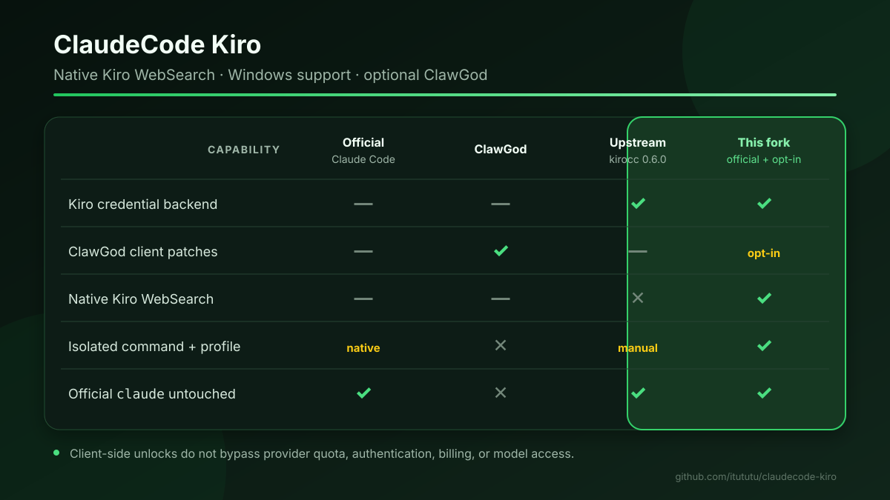
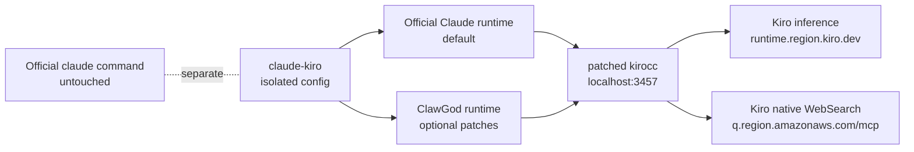
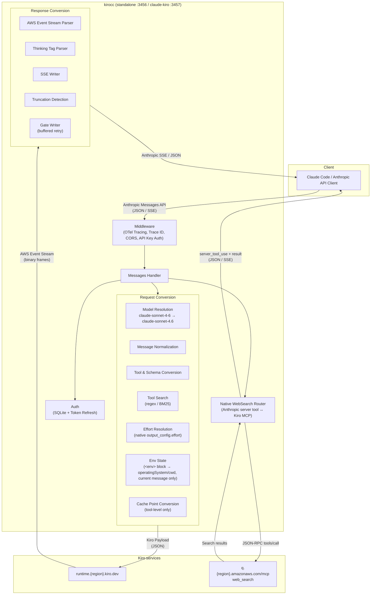

# ClawGod KiroCC

[中文说明](README.md) · [Changelog](CHANGELOG.md) · [Contributing](CONTRIBUTING.md) · [Releases](https://github.com/itututu/clawgod-kirocc/releases) · [Upstream kirocc](https://github.com/d-kuro/kirocc) · [ClawGod](https://github.com/0Chencc/clawgod) · [Telegram community](https://t.me/+y-jOB2WmYGo2YjQ1)

[](https://github.com/itututu/clawgod-kirocc/actions/workflows/ci.yml)
[](LICENSE)
[](https://github.com/0Chencc/clawgod/releases/tag/v1.7.5)

An isolated Claude Code launch profile backed by Kiro credentials, with
optional ClawGod patches and Kiro-native WebSearch support added to the excellent
[kirocc](https://github.com/d-kuro/kirocc) gateway.

This downstream project keeps the official `claude` command untouched. It
installs an explicit `claude-kiro` launcher, its own configuration directory,
and a patched gateway on port `3457`. The default mode uses the official Claude
Code runtime; ClawGod is installed only when explicitly selected.

> This project is not affiliated with Anthropic, Amazon, Kiro, d-kuro, or
> ClawGod. It does not contain Claude Code binaries, extracted source, private
> system prompts, credentials, or generated ClawGod files.

## Downloads and releases

The [first public prerelease, `v0.6.0-clawgod.1`](https://github.com/itututu/clawgod-kirocc/releases/tag/v0.6.0-clawgod.1),
is now available. This repository inherits the upstream kirocc release lineage
through `v0.6.0`, so those upstream tags are not republished as releases of this
fork.

Fork releases use `v<upstream-version>-clawgod.<fork-number>`. The first
prerelease is `v0.6.0-clawgod.1`; see the [Chinese-first release notes](docs/release-notes/v0.6.0-clawgod.1.md).
Always use the source installation below for the complete managed profile.

Release artifacts have a deliberately narrow boundary:

- Windows ZIP and macOS/Linux tar.gz archives contain only the standalone
  `kirocc` gateway and public documentation.
- Releases do not contain Claude Code, generated ClawGod files, credentials,
  sessions, or a complete managed `claude-kiro` installation.
- Clone the source and run `scripts/install.sh` or `scripts/install.ps1` for the
  managed launcher, isolated configuration, or optional ClawGod runtime.
- Verify release status and builds through [GitHub Actions](https://github.com/itututu/clawgod-kirocc/actions),
  and do not use binaries from unofficial mirrors.

## Community

Join the public [Telegram community](https://t.me/+y-jOB2WmYGo2YjQ1) for setup
discussion and release feedback. Never post Kiro credentials, API tokens,
provider files, or Claude session logs.

## Documentation map

- [Downloads and releases](#downloads-and-releases)
- [Why this fork exists](#why-this-fork-exists) and [comparison](#comparison)
- [Optional ClawGod capabilities](#optional-clawgod-capabilities) and [prompt behavior](#prompt-behavior)
- [Installation, verification, update, and uninstall](#installation-and-lifecycle)
- [Features](#features), [gateway-only installation](#gateway-only-installation), and [usage](#usage)
- [Endpoints](#endpoints), [architecture](#architecture), and feature deep dives
- [Known limitations](#known-limitations), [troubleshooting](#troubleshooting), [security](#security-and-data-handling), and [validation status](#testing-and-validation-status)

## Why this fork exists

Claude Code sends its built-in WebSearch as the Anthropic server tool
`web_search_20250305`. Upstream kirocc v0.6.0 forwards that definition to Kiro's
inference endpoint as an ordinary client tool, where it is rejected with an
upstream schema error. This fork detects the native server tool and calls Kiro's
regional MCP endpoint directly:

```text
https://q.<region>.amazonaws.com/mcp
```

The result is converted back to Anthropic-compatible `server_tool_use`,
`web_search_tool_result`, text, usage, and SSE events. The result block carries
the same `tool_use_id` as the server tool call.

## Comparison

Verified snapshot: Claude Code 2.1.220, ClawGod 1.7.5, kirocc 0.6.0, and Kiro
CLI 2.16.0 on macOS arm64 (2026-08-03).

The last comparison column describes the opt-in `--with-clawgod` profile. The
default install keeps the same Kiro/WebSearch/isolation features without the
ClawGod client patches.



| Capability | Official Claude Code | ClawGod only | Upstream kirocc 0.6.0 | ClawGod KiroCC |
| --- | :---: | :---: | :---: | :---: |
| Official Claude Code tool/runtime behavior | ✅ | ✅ patched | ✅ via API adapter | ✅ default / patched opt-in |
| Kiro CLI credential backend | — | — | ✅ | ✅ |
| Extended thinking / native effort | Provider-dependent | Provider-dependent | ✅ | ✅ |
| Anthropic Tool Search emulation | Provider-dependent | Provider-dependent | ✅ | ✅ |
| Built-in WebSearch through Kiro MCP | — | — | ❌ schema 502 | ✅ |
| Streaming WebSearch contract | Provider-dependent | Provider-dependent | ❌ | ✅ |
| Native Windows 11 x64 managed profile | ✅ | ✅ | Manual gateway | ✅ |
| Separate command and config profile | Native profile | Replaces/aliases launcher by default | Manual | ✅ `claude-kiro` |
| Leaves the official `claude` path untouched by this installer | ✅ | ❌ by default | ✅ | ✅ |
| Search MCP fallback can coexist | Manual | Manual | Manual | ✅ |
| ClawGod client-side feature unlocks and restriction patches | — | ✅ | — | ✅ opt-in |
| Bypasses provider-side quota, auth, billing, or model access | ❌ | ❌ | ❌ | ❌ |



## Optional ClawGod capabilities

Run the installer with `--with-clawgod` (PowerShell: `-WithClawGod`) to install
the pinned ClawGod v1.7.5 runtime patch with Lean mode off. Without that option,
`claude-kiro` uses the official Claude Code runtime and none of the patch groups
in this section are applied.

| ClawGod patch group | Included behavior in `claude-kiro` |
| --- | --- |
| Feature unlocks | Internal User Mode and hidden commands, GrowthBook flag overrides, Agent Teams, third-party Auto-mode, and the client gates for Computer Use, Ultraplan, and Ultrareview |
| Restriction removals | Removes ClawGod's documented client-injected cyber-risk refusal, URL-generation restriction, cautious-action confirmation, and login notice instructions |
| Geo neutralization | Neutralizes the documented timezone/proxy/base-URL geo probe and Unicode-apostrophe selector |
| Visual patches | Green ClawGod branding indicates the patched runtime; message filters expose content hidden from non-Anthropic providers |
| Reliability patches | Restores Glob/Grep under the Bun runtime, enables the 1-hour prompt-cache allowlist, and applies the third-party billing-header cache fix |
| Lean settings | Explicitly set to `off`; Plan mode, Agent Teams, bundled skills, Workflows, Remote Control, and Artifact are not removed by Lean mode |

The ClawGod patch bodies and generated `cli.cjs` are intentionally not vendored
in this repository. [`scripts/install.sh`](scripts/install.sh) downloads the
pinned v1.7.5 installer, verifies its SHA-256, applies only the isolation-path
overrides in a temporary directory, and generates the runtime locally. GitHub
therefore shows the auditable integration and isolation code, while extracted
Claude Code source and generated runtime artifacts stay off Git.

Here, **unlock** or **restriction removal** means a patch to checks, feature
flags, or instructions implemented in the local Claude Code client. It does
**not** create extra Kiro or Anthropic quota, bypass server authentication,
billing, rate limits, subscription enforcement, regional service availability,
or model authorization. Computer Use and Remote-backed features still depend on
the local platform and the selected backend. Removing cautious-action prompts
also does not grant permission for destructive or unauthorized activity; review
commands before execution.

Compared with stock ClawGod, this project deliberately does not replace the
official `claude` launcher. In-place `claude-kiro update` is blocked so every
refresh keeps the isolated paths and checksum verification; use
`./scripts/install.sh --refresh-clawgod` instead.

## Prompt behavior

When selected, ClawGod still runs Claude Code's built-in system-prompt pipeline. This project
does not copy or publish that proprietary prompt. The isolated profile adds the
original, auditable [`config/CLAUDE.md`](config/CLAUDE.md) after the built-in
instructions to describe WebSearch routing, source-link expectations, update
isolation, credential hygiene, and verification rules.

## Installation and lifecycle

### Prerequisites

- macOS, Linux, or native Windows 11 x64
- Go 1.26+ and Node.js 18+
- one usable Kiro upstream credential: a Kiro CLI login database, or a Kiro API key and region
- an official Claude Code installation (used locally; never copied into this repository)
- macOS/Linux: curl
- optional ClawGod mode only: Bun 1.3.14+, ripgrep, and either `shasum` or `sha256sum`
- the per-user `.local/bin` directory on `PATH` (the Windows installer adds it)

Kiro CLI's native Windows distribution currently targets Windows 11 x64.
Standalone KiroCC release binaries may run elsewhere, but that does not prove
the complete authenticated profile is supported there.

Kiro CLI is **not a request-traffic proxy**. Database mode uses it only to log
in and create the local credential. `kirocc` sends every chat and WebSearch
request directly to Kiro. If the login database already exists, the gateway can
continue reading and refreshing it even if the `kiro-cli` command is later
removed; Kiro CLI is still needed to log in again or repair the account.

### Prepare Kiro authentication first

Choose one mode. For Kiro CLI database authentication, install and log in:

macOS/Linux:

```bash
curl -fsSL https://cli.kiro.dev/install | bash
kiro-cli login
kiro-cli whoami
```

Windows 11 PowerShell:

```powershell
irm 'https://cli.kiro.dev/install.ps1' | iex
kiro-cli login
kiro-cli whoami
```

Use `kiro-cli login --use-device-flow` when browser login is inconvenient. See
Kiro's official [installation](https://kiro.dev/docs/cli/installation/) and
[authentication](https://kiro.dev/docs/cli/authentication/) documentation.

To avoid installing Kiro CLI, use an API key instead. The variables must be
visible both to the installer and whenever `claude-kiro` is launched; this
project does not persist the key in the repository or launcher:

```bash
export KIRO_API_KEY=ksk_...
export KIRO_API_REGION=us-east-1
./scripts/install.sh
claude-kiro
```

```powershell
$env:KIRO_API_KEY = "ksk_..."
$env:KIRO_API_REGION = "us-east-1"
powershell.exe -NoProfile -ExecutionPolicy Bypass -File .\scripts\install.ps1
claude-kiro
```

### Default install: official Claude Code runtime

macOS/Linux:

```bash
git clone https://github.com/itututu/clawgod-kirocc.git
cd clawgod-kirocc
./scripts/install.sh
claude-kiro
```

Windows PowerShell:

```powershell
git clone https://github.com/itututu/clawgod-kirocc.git
Set-Location clawgod-kirocc
powershell.exe -NoProfile -ExecutionPolicy Bypass -File .\scripts\install.ps1
claude-kiro
```

The default installer builds the patched gateway and creates an isolated
`claude-kiro` profile around the already-installed official Claude Code runtime.
It does not download ClawGod and does not create, replace, rename, or delete the
official `claude` command. Before building, it now requires either
`KIRO_API_KEY` or an existing login database. A missing credential stops with
the official Kiro CLI install/login commands instead of producing an install
whose first request must fail with 401.

### Opt in to ClawGod

macOS/Linux:

```bash
./scripts/install.sh --with-clawgod
```

Windows PowerShell:

```powershell
powershell.exe -NoProfile -ExecutionPolicy Bypass -File .\scripts\install.ps1 -WithClawGod
```

Opt-in mode downloads the pinned ClawGod v1.7.5 installer, verifies its
platform-specific SHA-256, patches only the temporary installer copy with
isolation overrides, and generates ClawGod locally. The pinned installer hashes
are:

- macOS/Linux `install.sh`: `4a943439ae8cb858e69279d19f0d3a979968fc0a9e4c42e1d1018ae76657ce82`
- Windows `install.ps1`: `bf2a9947f5f5747ceaf0ebc77f8f0c66887a2c390e7e996c28b6c72b5b579d3e`

### Installed layout

| Purpose | macOS/Linux | Windows |
| --- | --- | --- |
| Explicit launcher | `~/.local/bin/claude-kiro` | `%USERPROFILE%\.local\bin\claude-kiro.cmd` |
| Patched gateway | `~/.local/share/clawgod-kirocc/bin/kirocc-native-websearch` | `%LOCALAPPDATA%\ClawGodKiroCC\clawgod-kirocc\bin\kirocc-native-websearch.exe` |
| Optional ClawGod files | `~/.local/share/clawgod-kirocc/clawgod/` | `%LOCALAPPDATA%\ClawGodKiroCC\clawgod-kirocc\clawgod\` |
| Isolated state | `~/.clawgod-kirocc/` | `%USERPROFILE%\.clawgod-kirocc\` |
| Isolated Claude config | `~/.clawgod-kirocc/claude-config/` | `%USERPROFILE%\.clawgod-kirocc\claude-config\` |
| Gateway logs | `${TMPDIR:-/tmp}/clawgod-kirocc-gateway-*` | `%TEMP%\clawgod-kirocc-gateway-*` |

The default launcher port is `3457`; standalone `kirocc` defaults to `3456`.
If a healthy gateway already answers at `KIROCC_URL`, the launcher reuses it.
Otherwise it starts one for the lifetime of the `claude-kiro` process and stops
that child gateway on exit.

### Verify the installation

macOS/Linux:

```bash
./scripts/doctor.sh
command -v claude
command -v claude-kiro
claude --version
claude-kiro --version
```

Windows PowerShell:

```powershell
.\scripts\doctor.ps1
Get-Command claude
Get-Command claude-kiro
claude --version
claude-kiro --version
```

The doctor is read-only: it does not print credentials, modify configuration,
start Claude Code, or start/stop the gateway. A gateway-health warning is
normal while `claude-kiro` is closed. Use `./scripts/doctor.sh --strict` in
automation when warnings should also produce a non-zero exit status.

The two command paths must be different. In the default mode both commands use
the official runtime, but only `claude-kiro` uses the isolated Kiro-backed
profile. Green ClawGod branding appears only after selecting ClawGod. A version
command can exit before there is time to inspect
the managed health endpoint, so check `http://127.0.0.1:3457/health` only while
an interactive `claude-kiro` session is open.

### Installer options and overrides

```text
./scripts/install.sh [--with-clawgod] [--refresh-clawgod] [--gateway-only]
.\scripts\install.ps1 [-WithClawGod] [-RefreshClawGod] [-GatewayOnly]
```

| Option or variable | Purpose |
| --- | --- |
| `--with-clawgod` / `-WithClawGod` | Opt in to the pinned isolated ClawGod runtime |
| `--refresh-clawgod` / `-RefreshClawGod` | Rebuild ClawGod and implicitly select it |
| `--gateway-only` / `-GatewayOnly` | Legacy advanced mode around an explicit `CLAWGOD_BIN`; implicitly selects ClawGod |
| `CLAWGOD_BIN` | Existing explicit ClawGod launcher used by gateway-only mode |
| `CLAWGOD_RELEASE` | ClawGod release tag; defaults to `v1.7.5` |
| `CLAWGOD_INSTALLER_SHA256` | Required expected checksum when changing the release tag |
| `CLAUDE_KIRO_RUNTIME_BIN` | Override the runtime used by `claude-kiro` without changing official `claude` |
| `CLAWGOD_KIROCC_INSTALL_ROOT` | Runtime root; defaults to the OS-specific path above |
| `CLAWGOD_KIROCC_STATE_ROOT` | State root; defaults to `~/.clawgod-kirocc` |
| `CLAWGOD_KIROCC_BIN_DIR` | Launcher directory; defaults to `~/.local/bin` |
| `KIROCC_PORT` | Managed gateway port; defaults to `3457` |

Example using an existing isolated ClawGod executable:

```bash
CLAWGOD_BIN=/absolute/path/to/clawgod ./scripts/install.sh --gateway-only
```

### Update and uninstall

`claude-kiro update` is intentionally blocked because upstream self-update
would escape the checksum and isolation boundary. Update through this repository:

```bash
git pull --ff-only
./scripts/install.sh                    # default official-runtime mode
./scripts/install.sh --refresh-clawgod # selected ClawGod mode
```

Windows PowerShell:

```powershell
git pull --ff-only
powershell.exe -NoProfile -ExecutionPolicy Bypass -File .\scripts\install.ps1
powershell.exe -NoProfile -ExecutionPolicy Bypass -File .\scripts\install.ps1 -RefreshClawGod
```

Run only the last command when the selected runtime is ClawGod.

Remove binaries while preserving the isolated state:

```bash
./scripts/uninstall.sh
```

Delete the isolated configuration, projects, and session state as well:

```bash
./scripts/uninstall.sh --purge-state
```

Windows equivalents are `.\scripts\uninstall.ps1` and
`.\scripts\uninstall.ps1 -PurgeState`.

## Features

- **Anthropic Messages API compatible** — Supports `/v1/messages` (streaming / non-streaming), `/v1/messages/count_tokens`, and `/v1/models`
- **Request conversion** — Automatically converts Anthropic API requests to Kiro API (AWS Event Stream) format
- **Response conversion** — Converts Kiro event streams back to Anthropic SSE format
- **Automatic auth management** — Reads and refreshes Kiro CLI SQLite credentials (Social/OIDC), or uses an explicit Kiro API key and region
- **Model mapping** — Maps Anthropic model names (e.g., `claude-sonnet-4-6`) to Kiro model names. Customizable via environment variable
- **Extended Thinking** — Enable via the `[1m]` suffix, the `thinking` field, or `output_config.effort`. Reasoning depth travels natively as `additionalModelRequestFields.output_config.effort` (validated against each model's enum; defaults to `medium` for effort-capable models when thinking is on without an explicit effort)
- **Tool Search** — Proxy-side implementation of Anthropic's [Tool Search Tool](https://platform.claude.com/docs/en/agents-and-tools/tool-use/tool-search-tool). Supports `tool_search_tool_regex_20251119` and `tool_search_tool_bm25_20251119` with `defer_loading` for on-demand tool discovery
- **Kiro-native WebSearch** — Executes Claude Code's `web_search_20250305` through Kiro MCP with paired Anthropic result blocks, streaming SSE, retry, token counting, and server-tool usage
- **Isolated runtime profile** — Dedicated `claude-kiro` command, state, config, gateway binary, port, and update boundary around official Claude Code by default, with ClawGod as an explicit opt-in; official `claude` is not modified
- **Prompt Caching** — Converts Anthropic tool-level `cache_control` to Kiro `cachePoint`
- **Truncation detection** — Automatically injects a notice into the next request when a response is truncated
- **Retry** — Exponential backoff retry for 403 (token expiry), 429, and 5xx errors. Also retries thinking-only (empty visible) responses
- **SSE keep-alive** — Sends an idle comment heartbeat every 15 seconds by default; configurable or disableable
- **API key auth** — Optional access restriction for the proxy itself
- **CORS** — Allows requests from localhost origins
- **File logging** — Write structured logs (OTel JSON Lines) to a rotating file via [lumberjack](https://github.com/natefinch/lumberjack). Defaults optimized for coding agent consumption (10 MB, uncompressed)
- **OpenTelemetry tracing** — Opt-in distributed tracing via `--otel` with OTLP HTTP exporter. Captures request/response headers and body as span events across the full proxy chain

## Gateway-only installation

Use this path when you want only the Anthropic-compatible gateway without the
managed `claude-kiro` profile. It requires Go 1.26+ and either a logged-in
[Kiro CLI](https://kiro.dev) or a Kiro API key.

### Build the standalone gateway

```bash
git clone https://github.com/itututu/clawgod-kirocc.git
cd clawgod-kirocc
GOEXPERIMENT=jsonv2 go build -trimpath -o ./dist/kirocc ./cmd/kirocc
```

The Go module path intentionally remains `github.com/d-kuro/kirocc` to retain
upstream compatibility and attribution. Use the source build above or release
binaries instead of `go install` from the fork URL.

## Usage

### Isolated `claude-kiro` launcher

Normal use needs only:

```bash
claude-kiro
```

The launcher sets the isolated `CLAUDE_CONFIG_DIR`, points
`ANTHROPIC_BASE_URL` at the gateway, clears conflicting Anthropic/Bedrock/
Vertex/Foundry provider variables, and forwards every argument to the selected
runtime: official Claude Code by default or ClawGod when explicitly installed.

Runtime overrides:

| Variable | Purpose |
| --- | --- |
| `KIROCC_BIN` | Alternate patched gateway executable |
| `CLAUDE_KIRO_RUNTIME_BIN` | Alternate official or patched runtime executable |
| `CLAWGOD_BIN` | Compatibility alias for an alternate ClawGod executable |
| `CLAUDE_KIRO_CONFIG_DIR` / `CLAWGOD_KIROCC_CONFIG_DIR` | Alternate isolated Claude configuration directory |
| `KIROCC_PORT` | Port used when the launcher starts its own gateway |
| `KIROCC_URL` | Reuse an existing gateway URL instead of the default `http://127.0.0.1:$KIROCC_PORT` |
| `KIROCC_API_KEY` | Protect the gateway and use the same value as Claude's local proxy token |

### Start the standalone gateway

```bash
./dist/kirocc
```

Listens on `http://127.0.0.1:3456` by default.

### Use with Claude Code

```bash
export ANTHROPIC_BASE_URL=http://127.0.0.1:3456
export ANTHROPIC_AUTH_TOKEN=dummy
claude
```

`ANTHROPIC_AUTH_TOKEN` is required by Claude Code but not used for authentication by kirocc (credentials are read from Kiro CLI's DB). Any non-empty value works unless `-api-key` is set.

### Kiro authentication modes

The gateway supports two mutually exclusive upstream credential sources:

1. **Kiro CLI database (default):** reads the OS-specific SQLite database and
   refreshes Social/OIDC credentials automatically.
2. **Kiro API key:** set `KIRO_API_KEY=ksk_...` and optionally
   `KIRO_API_REGION` (default `us-east-1`), or pass `-kiro-api-key` and
   `-kiro-api-region`. This bypasses the local Kiro CLI database, not Kiro's
   server-side authorization or quota checks.

`KIROCC_API_KEY` is different: it protects access to the **local proxy**. It is
not a Kiro credential.

The data path is below; `kiro-cli` is not in the per-request path:

```text
Claude Code ──Anthropic API──> 127.0.0.1:3457 (kirocc)
                                      │
                         reads DB or KIRO_API_KEY
                                      │
                                      └──> Kiro Messages API / Kiro MCP
```

The gateway performs request conversion, upstream delivery, and credential
refresh itself. Native WebSearch also calls Kiro MCP directly; it does not
spawn a `kiro-cli` child process.

### Command-line options

| Flag               | Default                   | Description                                                        |
| ------------------ | ------------------------- | ------------------------------------------------------------------ |
| `-port`            | `3456`                    | Listen port                                                        |
| `-host`            | `127.0.0.1`               | Bind host                                                          |
| `-db`              | (OS-dependent, see below) | Kiro CLI SQLite DB path                                            |
| `-api-key`         | (none)                    | API key required to access the proxy                               |
| `-kiro-api-key`    | (none)                    | Kiro `ksk_...` key instead of the Kiro CLI database credential     |
| `-kiro-api-region` | `us-east-1`               | Region used with Kiro API-key authentication                       |
| `-debug`           | `false`                   | Enable debug logging                                               |
| `-keepalive-interval` | `15s`                  | SSE idle keep-alive interval; `0` disables it                      |
| `-log-file`        | (none)                    | Write logs to file with rotation (file-only by default)            |
| `-log-max-size`    | `10`                      | Max log file size in MB before rotation                            |
| `-log-max-backups` | `5`                       | Max number of old log files to retain                              |
| `-log-max-age`     | `7`                       | Max days to retain old log files                                   |
| `-log-compress`    | `false`                   | Compress rotated log files with gzip                               |
| `-log-console`     | `false`                   | Also write logs to console when `-log-file` is set                 |
| `-otel`            | `false`                   | Enable OpenTelemetry tracing (OTLP HTTP exporter)                  |
| `-otel-body-limit` | `32768`                   | Max bytes of request body to capture in OTel spans (0 = unlimited) |

#### Default DB path

| OS    | Path                                                  |
| ----- | ----------------------------------------------------- |
| macOS | `~/Library/Application Support/kiro-cli/data.sqlite3` |
| Linux | `~/.local/share/kiro-cli/data.sqlite3`                |
| Windows | `%USERPROFILE%\.local\share\kiro-cli\data.sqlite3`; the launcher also probes `%LOCALAPPDATA%` and `%APPDATA%` |

### Environment variables

Command-line options can be overridden with environment variables.

| Variable                 | Corresponding option |
| ------------------------ | -------------------- |
| `KIROCC_PORT`            | `-port`              |
| `KIROCC_HOST`            | `-host`              |
| `KIROCC_DB_PATH`         | `-db`                |
| `KIROCC_API_KEY`         | `-api-key`           |
| `KIRO_API_KEY`           | `-kiro-api-key`      |
| `KIRO_API_REGION`        | `-kiro-api-region`   |
| `KIROCC_DEBUG`           | `-debug`             |
| `KIROCC_KEEPALIVE_INTERVAL` | `-keepalive-interval` |
| `KIROCC_LOG_FILE`        | `-log-file`          |
| `KIROCC_LOG_MAX_SIZE`    | `-log-max-size`      |
| `KIROCC_LOG_MAX_BACKUPS` | `-log-max-backups`   |
| `KIROCC_LOG_MAX_AGE`     | `-log-max-age`       |
| `KIROCC_LOG_COMPRESS`    | `-log-compress`      |
| `KIROCC_LOG_CONSOLE`     | `-log-console`       |
| `KIROCC_OTEL`            | `-otel`              |
| `KIROCC_OTEL_BODY_LIMIT` | `-otel-body-limit`   |
| `KIROCC_MODEL_MAPPINGS`  | Custom model mapping JSON (no flag) |

### OpenTelemetry tracing

Enable distributed tracing to visualize the full request chain in Jaeger, Grafana Tempo, or any OTLP-compatible backend.

```bash
# Start a local collector (e.g., Grafana LGTM stack)
docker run -d --name lgtm -p 3000:3000 -p 4317:4317 -p 4318:4318 grafana/otel-lgtm

# Start the locally built gateway with tracing enabled
./dist/kirocc -otel
```

The OTLP endpoint defaults to `http://localhost:4318` and can be configured via the standard `OTEL_EXPORTER_OTLP_ENDPOINT` environment variable.

### Custom model mappings

Use the `KIROCC_MODEL_MAPPINGS` environment variable to override model name mappings.

```bash
export KIROCC_MODEL_MAPPINGS='[{"anthropic":"my-model","kiro":"claude-sonnet-4.5","context_window_size":200000}]'
```

## Endpoints

| Path                             | Description                              |
| -------------------------------- | ---------------------------------------- |
| `GET /health`                    | Health check                             |
| `GET /v1/models`                 | List available models                    |
| `POST /v1/messages`              | Messages API (streaming / non-streaming) |
| `POST /v1/messages/count_tokens` | Token count (approximate \*)             |

\* `count_tokens` uses the `cl100k_base` encoding from [tiktoken-go](https://github.com/pkoukk/tiktoken-go), which differs from Claude's actual tokenizer. The returned value is an approximation.

## Architecture



### Request flow

1. Client sends an Anthropic Messages API request to kirocc
2. Middleware assigns a trace ID, handles CORS, and validates the API key
3. Auth reads/refreshes credentials from Kiro CLI's SQLite DB
4. Handler resolves the model name and determines thinking mode
5. A request containing only Anthropic's native `web_search_20250305` server
   tool takes the Kiro MCP path: the handler extracts the query, calls
   `tools/call`, and writes paired `server_tool_use` and
   `web_search_tool_result` blocks as JSON or SSE. It never reaches the Kiro
   inference endpoint.
6. All other requests use the inference conversion pipeline:
   - Normalizes messages (merges consecutive same-role messages, extracts text/images/tool_use/tool_result from multi-block content)
   - Converts tools and sanitizes JSON Schema (removes unsupported keywords, flattens `anyOf`/`oneOf`/`allOf`)
   - If tool search tools are present, partitions tools into active/deferred and injects a proxy-side `ToolSearch` tool
   - Extracts system prompt and places it as a history entry pair
   - Parses the `<env>` block from the system prompt into `envState` (`operatingSystem`, `currentWorkingDirectory`) and attaches it to the current message only
   - Reorders tool results to match the preceding assistant's tool_use order
   - Forwards reasoning effort natively as `additionalModelRequestFields.output_config.effort` at the request root (sibling of `conversationState`); the resolved effort is validated/clamped per model
   - Converts Anthropic tool-level `cache_control` to Kiro `cachePoint`
7. Kiro API returns an AWS Event Stream (binary frames)
8. Response conversion pipeline:
   - Parses binary event stream frames
   - Converts cumulative text to incremental deltas
   - Intercepts `ToolSearch` tool_use calls, executes search, emits `server_tool_use`/`tool_search_tool_result` SSE events, and re-requests Kiro with discovered tools (up to 3 rounds)
   - Parses `<thinking>` tags from `assistantResponseEvent` or uses `reasoningContentEvent` (with deduplication)
   - Enforces `stop_sequences` and `max_tokens` adapter-side
   - Detects truncated responses and stores them; a notice is injected into the next request
   - Gate Writer buffers output until visible content arrives, enabling transparent retry of thinking-only responses

### Native WebSearch

The supported Claude Code contract is a request whose `tools` array contains
exactly one `web_search_20250305` server tool. The gateway:

1. extracts Claude Code's search query from the final user message;
2. calls Kiro's regional MCP endpoint with JSON-RPC `tools/call` and
   `name: web_search`;
3. refreshes credentials on 403 and retries 429/5xx responses with backoff;
4. returns the same `tool_use_id` in `server_tool_use` and
   `web_search_tool_result`;
5. supports non-streaming JSON, ordered SSE events, token counting, and
   `usage.server_tool_use.web_search_requests`.

Deliberate current boundary: a hand-written request that combines native
WebSearch with another client tool returns HTTP 400. Claude Code's observed
built-in WebSearch subrequest uses the supported single-server-tool form.
Search availability, ranking, result freshness, and subscription enforcement
remain upstream Kiro behavior.

### Extended Thinking

kiro-cli 2.10.0 expresses reasoning depth natively through `output_config.effort`. kirocc forwards it as `additionalModelRequestFields.output_config.effort` at the request root (sibling of `conversationState`):

```json
{
  "conversationState": { "...": "..." },
  "additionalModelRequestFields": {
    "output_config": { "effort": "medium" }
  }
}
```

Thinking is enabled by any of:

- Model name with `[1m]` suffix (e.g., `claude-sonnet-4-6[1m]`)
- `Anthropic-Beta` header containing `context-1m` (e.g., `context-1m-2025-01-01`)
- `thinking.type` set to `"enabled"` or `"adaptive"` in the request

Exception: the `[1m]` suffix on an **always-1M** model (`claude-opus-4-8[1m]` / `claude-opus-4-7[1m]` / `claude-opus-4-6[1m]` / `claude-sonnet-5[1m]`) is a first-class alias that only advertises the 1M context window — it does **not** enable thinking (see [Model mappings](#model-mappings)). Thinking on those models is still opt-in via the `context-1m` header or the `thinking` field.

The reasoning effort sent to the backend is resolved as follows:

1. An explicit, recognized `output_config.effort` wins, validated/clamped to the model's allowed enum (`xhigh` on a 4-value model clamps to `max`; unrecognized strings are dropped).
2. Otherwise, if reasoning is enabled (via `thinking.type`, the `[1m]` suffix, or the `context-1m` header) without an explicit effort, a default effort of `medium` is sent so the intent reaches the backend.
3. Otherwise the field is omitted.

Per-model allowed effort levels:

- `claude-opus-4.8`, `claude-opus-4.7`, `claude-sonnet-5`: `low`, `medium`, `high`, `xhigh`, `max`
- `claude-opus-4.6`, `claude-sonnet-4.6` (and their `-1m` variants): `low`, `medium`, `high`, `max` (no `xhigh`; clamps to `max`)
- All other models omit `additionalModelRequestFields` entirely

`thinking.budget_tokens` is accepted in the request but no longer affects behavior; reasoning depth is conveyed entirely through `effort`.

### Tool Search

The Kiro backend does not support Anthropic's [Tool Search Tool](https://platform.claude.com/docs/en/agents-and-tools/tool-use/tool-search-tool). kirocc implements it proxy-side with an inner loop:

1. Client sends `tool_search_tool_regex_20251119` (or `bm25`) + tools with `defer_loading: true`
2. Proxy partitions tools into active (sent to Kiro) and deferred (held for search)
3. Proxy injects a `ToolSearch` tool definition that Kiro can understand
4. When the model calls `ToolSearch`, the proxy intercepts the tool_use:
   - Executes regex or BM25 search against deferred tools
   - Emits `server_tool_use` + `tool_search_tool_result` SSE events to the client
   - Promotes discovered tools to active and rebuilds the Kiro request
   - Calls Kiro again with the updated tool list (up to 3 rounds)
5. When the model calls a regular tool or produces text, the response is forwarded to the client

Supported query forms:

- `select:Read,Edit,Grep` — exact tool selection by name
- `read file` — keyword search (regex with word-level OR fallback, or BM25 scoring)

### Model mappings

| Input model             | Kiro model             | Context window |
| ----------------------- | ---------------------- | -------------- |
| `claude-sonnet-5`       | `claude-sonnet-5`      | 1M             |
| `claude-sonnet-5[1m]`   | `claude-sonnet-5`      | 1M             |
| `claude-sonnet-4-6`     | `claude-sonnet-4.6`    | 200k           |
| `claude-sonnet-4-6[1m]` | `claude-sonnet-4.6-1m` | 1M             |
| `claude-sonnet-4.5`     | `claude-sonnet-4.5`    | 200k           |
| `claude-sonnet-4.5[1m]` | `claude-sonnet-4.5-1m` | 1M             |
| `claude-opus-4-8`       | `claude-opus-4.8`      | 1M             |
| `claude-opus-4-8[1m]`   | `claude-opus-4.8`      | 1M             |
| `claude-opus-4-7`       | `claude-opus-4.7`      | 1M             |
| `claude-opus-4-7[1m]`   | `claude-opus-4.7`      | 1M             |
| `claude-opus-4-6`       | `claude-opus-4.6`      | 1M             |
| `claude-opus-4-6[1m]`   | `claude-opus-4.6`      | 1M             |
| `claude-opus-4.5`       | `claude-opus-4.5`      | 200k           |
| `claude-haiku-4.5`      | `claude-haiku-4.5`     | 200k           |

Opus 4.6, 4.7, 4.8, and Sonnet 5 always use 1M context (no 200k SKU exists upstream). Unlike Sonnet 4.6, `claude-sonnet-5` has no separate `-1m` SKU: the single `claude-sonnet-5` SKU is always 1M. The explicit `[1m]`-suffixed aliases (`claude-opus-4-8[1m]` / `claude-opus-4-7[1m]` / `claude-opus-4-6[1m]` / `claude-sonnet-5[1m]`) are first-class entries that preserve the suffix verbatim in the response `model` field — this matches Claude Code's default Max-plan state (`lG()` emits `claude-opus-4-8[1m]`) and keeps its `mR()` 1M-context check happy without spuriously enabling extended thinking. Thinking is still opt-in via Sonnet `[1m]` suffix, `Anthropic-Beta: context-1m` header, or `thinking` field.

Unmatched `claude-*` models are passed through as-is. Non-claude models fall back to `claude-sonnet-4.6`.

#### Response model ID

The `model` field in `/v1/messages` responses (streaming `message_start`, non-streaming body, and tool-search path) is returned as the **Anthropic-form ID** (e.g. `claude-opus-4-7`), not the Kiro SKU (`claude-opus-4.7`).

When the proxy routes to a **1M context window** (always-1M SKU such as `claude-opus-4.8` / `claude-opus-4.7` / `claude-opus-4.6`, or a model invoked with the `[1m]` suffix or `Anthropic-Beta: context-1m` header), a trailing `[1m]` is appended to the response model ID (e.g. `claude-opus-4-8[1m]`). Claude Code's client-side context-window logic matches `/\[1m\]/i` on the response model to pick the 1M window — without the suffix it defaults to 200k and auto-compacts at ~160k even when upstream actually has 1M of context.

Note: `[1m]` has different meanings on request vs. response. On the **request** `model` it is a client-supplied thinking-opt-in signal (and is stripped before upstream routing). On the **response** `model` it is purely a context-window advertisement for Claude Code and does not imply that extended thinking was enabled.

## Known limitations

- Native Windows support targets Windows 11 x64. PowerShell syntax, Windows Go
  tests, and PE builds run in CI, but a credentialed clean-install E2E on
  Windows remains environment-dependent.
- A hand-written request that mixes native WebSearch with client tools returns
  HTTP 400.
- `count_tokens` is approximate and does not use Claude's official tokenizer.
- Computer Use, Ultraplan, Ultrareview, and other unlocked entry points still
  depend on the OS, native modules, remote services, and Kiro compatibility.
- Kiro controls quota, model authorization, throttling, regional availability,
  and search quality/freshness.
- ClawGod in-place updates are disabled; refresh through this repository.
- Automated tests validate contracts and error paths, not current upstream
  service availability.

## Troubleshooting

| Symptom | Check or fix |
| --- | --- |
| `claude-kiro: command not found` | Add the per-user `.local/bin` directory to `PATH`; on Windows open a new terminal after installation |
| Installer reports a missing prerequisite | Default mode needs Go/Node (plus curl on macOS/Linux); Bun, ripgrep, and SHA-256 tooling are required only with ClawGod |
| `No usable Kiro credential source found` | Run the displayed Kiro CLI install command, then `kiro-cli login` and `kiro-cli whoami`; or set `KIRO_API_KEY`/`KIRO_API_REGION` for installation and launch |
| `official Claude Code command not found` | Install official Claude Code and confirm `command -v claude` before rerunning the installer |
| Gateway fails to start | Read `${TMPDIR:-/tmp}/clawgod-kirocc-gateway-$UID-${KIROCC_PORT:-3457}.log`; choose another port with `KIROCC_PORT=3458` if needed |
| `authentication failed` or Kiro returns 401/403 | This is an upstream Kiro credential problem: run `kiro-cli login`/`kiro-cli whoami` again, or verify `KIRO_API_KEY` and `KIRO_API_REGION` |
| `invalid API key` / running gateway rejects `KIROCC_API_KEY` | This is a local proxy password or stale-port conflict, not Kiro login; use the matching `KIROCC_API_KEY` or start a new instance with `KIROCC_PORT=3458` |
| WebSearch still reports the old schema 502 | Confirm `command -v claude-kiro`, rerun `./scripts/install.sh`, and verify the gateway binary is `kirocc-native-websearch` |
| Native WebSearch returns HTTP 400 | Do not combine `web_search_20250305` with client tools in one hand-written request |
| `claude-kiro update` is blocked | Expected; pull the repository and rerun the installer, adding the refresh option only for ClawGod mode |
| UI is not green | Expected in the default official-runtime mode; green branding requires `--with-clawgod` / `-WithClawGod` |
| Skills, MCPs, or history appear missing | Expected isolation: selectively copy or recreate only the configuration you want under `~/.clawgod-kirocc/claude-config`; do not symlink the entire official profile |

## Security and data handling

- The launcher and standalone gateway bind to `127.0.0.1` by default. If you
  bind to a non-loopback address, set a strong `KIROCC_API_KEY` and add network
  access controls.
- Kiro credentials remain in Kiro CLI's database or the process environment.
  They are never intentionally copied into this repository.
- Generated ClawGod files, extracted Claude Code content, provider files,
  sessions, logs, and local databases are excluded from Git.
- Debug logs and OpenTelemetry spans may contain request/response bodies. Store
  and share them as secrets; reduce `-otel-body-limit` or disable capture when
  handling sensitive code.
- ClawGod removes selected local caution prompts. That does not grant authority
  to access systems or perform destructive actions. Review tool calls and keep
  backups.
- Review [`SECURITY.md`](SECURITY.md) before reporting a vulnerability; never
  include live credentials or session logs in an issue or the Telegram group.

## Testing and validation status

```bash
make test
GOEXPERIMENT=jsonv2 go vet ./...
bash -n scripts/install.sh scripts/uninstall.sh scripts/doctor.sh
./scripts/doctor.sh --help >/dev/null
python3 -m json.tool config/settings.json >/dev/null
GOOS=windows GOARCH=amd64 CGO_ENABLED=0 GOEXPERIMENT=jsonv2 go build -o /tmp/kirocc.exe ./cmd/kirocc
```

`make test` runs `go test -race ./...`. CI repeats formatting/fix checks,
integration-file validation, golangci-lint, and the race test suite on Linux;
a native Windows job parses every PowerShell script, runs Go tests, and builds
the Windows gateway.

Verified snapshot on macOS arm64 (2026-08-03):

- isolated installer completed with the official Claude binary path, binary
  SHA-256, and official settings SHA-256 unchanged before/after;
- `claude-kiro --version` ran through the isolated ClawGod launcher;
- unit/contract tests covered Kiro MCP headers and JSON-RPC, 403 refresh,
  429/5xx retry, non-streaming blocks, ordered SSE events, matching
  `tool_use_id`, token count, and mixed-tool rejection;
- the public GitHub CI passed for the published code.

CI cannot prove current Kiro subscription availability, search ranking, remote
ClawGod services, or provider-side feature authorization. Credentialed live E2E
tests remain environment-dependent and should not be inferred from unit-test
success.

## License

- This repository and the kirocc-derived code: Apache-2.0.
- Upstream [kirocc](https://github.com/d-kuro/kirocc): Apache-2.0.
- [ClawGod](https://github.com/0Chencc/clawgod): GPL-3.0; downloaded and
  generated locally, not redistributed by this repository.
- Claude Code: proprietary Anthropic software and not included.

See [`NOTICE`](NOTICE) for attribution and modification boundaries.
