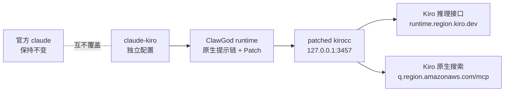
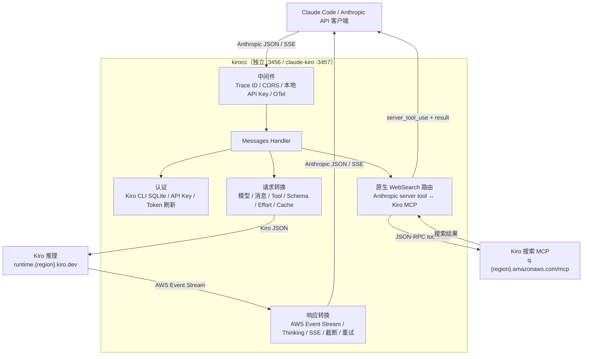

# ClawGod KiroCC

[English](README.md) · [上游 kirocc](https://github.com/d-kuro/kirocc) · [ClawGod](https://github.com/0Chencc/clawgod) · [Telegram 交流群](https://t.me/+y-jOB2WmYGo2YjQ1)

这是一个公开、可审计的 Claude Code + ClawGod + Kiro CLI 集成版本。它在
kirocc 基础上补齐 Kiro 原生 WebSearch，并通过独立的 `claude-kiro` 命令运行，
不覆盖官方 `claude` 命令。

> 本项目与 Anthropic、Amazon、Kiro、d-kuro、ClawGod 均无隶属关系。
> 仓库不包含 Claude Code 二进制、提取源码、私有内置系统提示词、账号凭据、
> 会话历史或本机生成的 ClawGod runtime。

## 交流群

安装交流和版本反馈：[加入 Telegram 交流群](https://t.me/+y-jOB2WmYGo2YjQ1)。
请勿在群内发送 Kiro 凭据、API Token、Provider 文件或 Claude 会话日志。

## 文档导航

- [问题背景](#解决的问题)和[版本对比](#版本对比图)
- [ClawGod 功能](#已集成的-clawgod-功能)和[提示词行为](#clawgod-内置提示词能否继续使用)
- [安装、验证、更新和卸载](#安装与生命周期)
- [主要功能](#主要功能)、[仅安装网关](#仅安装网关)和[使用方式](#使用方式)
- [API](#api-endpoint)、[架构](#架构)和功能原理
- [已知边界](#已知边界)、[排障](#排障)、[安全](#安全与数据处理)和[测试](#测试与验证状态)

## 解决的问题

Claude Code 内置 WebSearch 会发送 Anthropic server tool：

```json
{
  "tools": [
    {
      "max_uses": 8,
      "type": "web_search_20250305",
      "name": "web_search"
    }
  ],
  "tool_choice": {"type": "tool", "name": "web_search"}
}
```

上游 kirocc v0.6.0 会把它当成普通客户端工具发送到 Kiro 推理接口，最终出现
`TOOL_SCHEMA_INVALID`/502。本版本改为直接调用 Kiro 原生 MCP：

```text
https://q.<region>.amazonaws.com/mcp
```

并返回 Claude Code 能识别的：

- `server_tool_use`
- 带相同 `tool_use_id` 的 `web_search_tool_result`
- `web_search_result`
- 非流式 JSON 与完整 SSE 流式事件
- `usage.server_tool_use.web_search_requests`
- 403 凭据刷新以及 429/5xx 重试

## 版本对比图

验证快照：Claude Code 2.1.220、ClawGod 1.7.5、kirocc 0.6.0、Kiro CLI
2.16.0、macOS arm64，日期 2026-08-03。

| 能力 | 官方 Claude Code | 仅 ClawGod | 上游 kirocc 0.6.0 | 我们的 ClawGod KiroCC |
| --- | :---: | :---: | :---: | :---: |
| Claude Code 原生工具和运行时 | ✅ | ✅ 已 Patch | ✅ 经协议适配 | ✅ 已 Patch |
| 使用 Kiro CLI 订阅/凭据 | — | — | ✅ | ✅ |
| 原生 effort/扩展思考 | 取决于官方账号 | 取决于 Provider | ✅ | ✅ |
| Anthropic Tool Search 模拟 | 取决于官方接口 | 取决于 Provider | ✅ | ✅ |
| 内置 WebSearch 走 Kiro MCP | — | — | ❌ 502 | ✅ |
| WebSearch 非流式与 SSE 流式 | 官方支持 | 取决于 Provider | ❌ | ✅ |
| 单独命令、配置和端口 | 官方配置 | 默认会替换/别名启动器 | 需手工配置 | ✅ |
| 本安装器不改官方 `claude` 路径 | ✅ | ❌ 默认安装行为 | ✅ | ✅ |
| DuckDuckGo 等搜索 MCP 作为备用 | 手工 | 手工 | 手工 | ✅ 可共存 |
| ClawGod 客户端功能解锁和限制移除 Patch | — | ✅ | — | ✅ |
| 绕过服务端额度、鉴权、计费或模型权限 | ❌ | ❌ | ❌ | ❌ |



## 已集成的 ClawGod 功能

本项目安装锁定的 ClawGod v1.7.5 runtime patch，并显式使用
`--lean-off`，所以独立的 `claude-kiro` 配置会保留完整 Claude Code 工具集。

| ClawGod Patch 类别 | `claude-kiro` 中包含的能力 |
| --- | --- |
| 功能解锁 | Internal User Mode 和隐藏命令、GrowthBook 功能旗标覆盖、Agent Teams、第三方 Provider Auto-mode，以及 Computer Use、Ultraplan、Ultrareview 的客户端入口解锁 |
| 限制移除 | 移除 ClawGod 文档列出的客户端安全测试拒绝提示、URL 生成限制、谨慎操作强制确认和未登录提示 |
| 地区检测中和 | 中和其文档列出的时区/代理/Base URL 地区探针和 Unicode 撇号选择器 |
| 视觉 Patch | 绿色 ClawGod 品牌色表示正在运行 Patch 版本；消息过滤 Patch 会显示原本对非 Anthropic Provider 隐藏的内容 |
| 可靠性 Patch | Bun runtime 下恢复 Glob/Grep、启用 1 小时 Prompt Cache allowlist、修复第三方 Provider billing header 导致的缓存命中问题 |
| Lean 设置 | 明确设为 `off`；不会由 Lean 模式删除 Plan mode、Agent Teams、内置 Skills、Workflows、Remote Control 或 Artifact |

仓库有意不提交 ClawGod Patch 本体、生成的 `cli.cjs` 或提取出的 Claude Code
源码。[`scripts/install.sh`](scripts/install.sh) 会下载锁定的 v1.7.5 installer、
校验 SHA-256、只在临时目录加入隔离路径覆盖，然后在用户本机生成 runtime。
因此 GitHub 显示的是可审计的集成和隔离代码，生成运行时不会进入 Git。

这里的“解锁”或“绕过限制”指修改本地 Claude Code 客户端中的检查、功能旗标或
注入提示，**不代表**可以增加 Kiro/Anthropic 服务端额度，也不能绕过服务端鉴权、
计费、限流、订阅校验、地区服务可用性或模型权限。Computer Use 和依赖 Remote
的功能仍取决于本机平台及所用后端。移除谨慎操作提示也不等于获得执行破坏性或
未授权操作的许可，运行命令前仍需自行确认。

与原版 ClawGod 不同，本项目不会替换官方 `claude` 启动器，并禁止
`claude-kiro update` 原地更新，以防破坏隔离路径和校验边界。更新请运行：

```bash
./scripts/install.sh --refresh-clawgod
```

## ClawGod 内置提示词能否继续使用

可以。ClawGod 仍然运行 Claude Code 自带的系统提示链和 runtime patch；KiroCC
只替换 Anthropic API 的后端地址，不会移除这条提示链。

但官方 Claude Code 内置系统提示词属于专有内容，本仓库不会把从 `cli.cjs` 中
提取出的提示词复制到 GitHub。公开版使用原创、可审计的
[`config/CLAUDE.md`](config/CLAUDE.md) 作为附加提示，负责：

- 优先使用 Kiro 原生 WebSearch
- 搜索答案提供来源链接
- 搜索失败时允许显式配置的 MCP 备用
- 保护官方 Claude Code 安装和更新边界
- 禁止提交凭据、Provider 文件和会话历史
- 要求测试和诚实报告真实联网验收边界

这份 `CLAUDE.md` 是附加规则，不冒充、复制或替换官方内置提示词。

## 安装与生命周期

### 依赖

- macOS 或 Linux
- Go 1.26+
- Node.js 18+
- Bun、curl、ripgrep
- 已安装并登录的 Kiro CLI，或可用的 Kiro API Key 和 Region
- 官方 Claude Code（只在用户本机使用，不会进入仓库）
- `~/.local/bin` 已加入 `PATH`

### 安装完整配置

```bash
git clone https://github.com/itututu/clawgod-kirocc.git
cd clawgod-kirocc
./scripts/install.sh
claude-kiro
```

安装器会：

1. 编译带原生 WebSearch 的 kirocc。
2. 下载锁定的 ClawGod v1.7.5 installer。
3. 校验 installer SHA-256：
   `4a943439ae8cb858e69279d19f0d3a979968fc0a9e4c42e1d1018ae76657ce82`。
4. 仅在临时目录给 installer 增加隔离路径参数。
5. 把生成的 ClawGod runtime 放到 `~/.local/share/clawgod-kirocc`。
6. 把独立状态和 Claude 配置放到 `~/.clawgod-kirocc`。
7. 创建 `~/.local/bin/claude-kiro`，默认使用 3457 端口。

本安装器不会创建、替换或删除 `claude` 命令。

### 安装目录

| 路径 | 用途 |
| --- | --- |
| `~/.local/bin/claude-kiro` | 独立入口；启动/复用网关后运行隔离 ClawGod |
| `~/.local/share/clawgod-kirocc/bin/kirocc-native-websearch` | 带 Kiro 原生 WebSearch 的网关 |
| `~/.local/share/clawgod-kirocc/clawgod/` | 隔离的 ClawGod 启动器和本地 runtime 引用 |
| `~/.clawgod-kirocc/` | 生成的 ClawGod runtime、vendor 文件和独立状态 |
| `~/.clawgod-kirocc/claude-config/` | 独立 Claude 设置、项目、会话和附加 `CLAUDE.md` |
| `${TMPDIR:-/tmp}/clawgod-kirocc-gateway-$UID-3457.log` | 默认端口的网关启动日志 |

`claude-kiro` 管理的默认端口为 `3457`；单独运行 `kirocc` 的默认端口为
`3456`。如果 `KIROCC_URL` 已有健康网关，启动器会直接复用；否则会启动一个
子进程，并在 `claude-kiro` 退出时清理该子进程。

### 验证安装与隔离

```bash
command -v claude
command -v claude-kiro
claude --version
claude-kiro --version
```

前两个路径必须不同。官方 `claude` 保持原有外观；交互运行
`claude-kiro` 时应看到 ClawGod 的绿色 Patch 品牌色。`--version` 很快退出，
启动器也会同步关闭临时网关；仅在交互会话打开期间检查：

```bash
curl http://127.0.0.1:3457/health
```

### 安装参数和覆盖变量

```text
./scripts/install.sh [--refresh-clawgod] [--gateway-only]
```

| 参数或变量 | 作用 |
| --- | --- |
| `--refresh-clawgod` | 在相同校验和隔离边界内重新生成 ClawGod runtime |
| `--gateway-only` | 围绕显式 `CLAWGOD_BIN` 构建网关和 `claude-kiro` 启动器 |
| `CLAWGOD_BIN` | gateway-only 模式使用的现有 ClawGod 启动器 |
| `CLAWGOD_RELEASE` | ClawGod Release Tag，默认 `v1.7.5` |
| `CLAWGOD_INSTALLER_SHA256` | 更换 Release 时必须提供的预期校验值 |
| `CLAWGOD_KIROCC_INSTALL_ROOT` | runtime 根目录，默认 `~/.local/share/clawgod-kirocc` |
| `CLAWGOD_KIROCC_STATE_ROOT` | 状态根目录，默认 `~/.clawgod-kirocc` |
| `CLAWGOD_KIROCC_BIN_DIR` | 启动器目录，默认 `~/.local/bin` |
| `KIROCC_PORT` | 启动器管理的网关端口，默认 `3457` |

如果已有独立 ClawGod：

```bash
CLAWGOD_BIN=/绝对路径/clawgod ./scripts/install.sh --gateway-only
```

### 更新与卸载

`claude-kiro update` 被有意禁用，防止上游自更新绕开校验和隔离边界。更新方式：

```bash
git pull --ff-only
./scripts/install.sh --refresh-clawgod
```

卸载但保留配置和会话状态：

```bash
./scripts/uninstall.sh
```

同时删除独立状态：

```bash
./scripts/uninstall.sh --purge-state
```

## 主要功能

- **Anthropic Messages API 兼容**：支持 `/v1/messages`（流式/非流式）、`/v1/messages/count_tokens` 和 `/v1/models`。
- **请求/响应协议转换**：Anthropic JSON/SSE 与 Kiro JSON/AWS Event Stream 双向转换。
- **自动认证管理**：读取 Kiro CLI SQLite 凭据并自动刷新 Social/OIDC Token，也支持 Kiro API Key。
- **模型映射**：将 Anthropic 风格模型名映射为 Kiro SKU，可通过环境变量覆盖。
- **扩展思考**：支持 `[1m]`、`thinking` 和 `output_config.effort`，原生转发并按模型枚举校验/收敛 effort。
- **Tool Search**：在代理侧实现 regex/BM25 Tool Search 和 `defer_loading` 按需工具发现。
- **Kiro 原生 WebSearch**：把 `web_search_20250305` 映射到 Kiro MCP，支持 JSON、SSE、重试、Token Count 和 server-tool usage。
- **隔离 ClawGod 配置**：独立命令、状态、配置、网关、端口和更新边界，不修改官方 `claude`。
- **Prompt Cache**：把 Anthropic 工具级 `cache_control` 转换为 Kiro `cachePoint`。
- **截断检测与重试**：记录截断结果；对 403、429、5xx 和仅含 thinking 的空可见响应重试。
- **SSE Keep-alive**：默认每 15 秒为长时间无输出的流发送注释心跳。
- **本地代理鉴权/CORS**：可设置代理 API Key，并允许 localhost 来源。
- **日志与 OpenTelemetry**：支持轮转 JSON Lines 日志和 OTLP HTTP 全链路追踪。

## 仅安装网关

如果只需要 Anthropic → Kiro 网关而不需要 ClawGod 隔离配置：

```bash
git clone https://github.com/itututu/clawgod-kirocc.git
cd clawgod-kirocc
GOEXPERIMENT=jsonv2 go build -trimpath -o ./dist/kirocc ./cmd/kirocc
```

Go module 路径保留为 `github.com/d-kuro/kirocc`，用于兼容上游和保留归属。
请使用上述源码构建或 Release 二进制，不要对 Fork URL 直接执行 `go install`。

## 使用方式

### 使用隔离的 `claude-kiro`

```bash
claude-kiro
```

启动器会设置独立 `CLAUDE_CONFIG_DIR`，把 `ANTHROPIC_BASE_URL` 指向本地网关，
清除可能冲突的 Anthropic/Bedrock/Vertex/Foundry Provider 变量，然后把全部参数
转交给 ClawGod。

运行时覆盖变量：

| 变量 | 作用 |
| --- | --- |
| `KIROCC_BIN` | 指定另一个带 Patch 的网关二进制 |
| `CLAWGOD_BIN` | 指定另一个显式 ClawGod 启动器 |
| `CLAWGOD_KIROCC_CONFIG_DIR` | 指定另一个独立 Claude 配置目录 |
| `KIROCC_PORT` | 启动器自行启动网关时使用的端口 |
| `KIROCC_URL` | 复用已有网关 URL，替代默认 `http://127.0.0.1:$KIROCC_PORT` |
| `KIROCC_API_KEY` | 保护本地网关，并作为 Claude 访问本地代理的 Token |

### 单独启动网关

```bash
./dist/kirocc
```

默认监听 `http://127.0.0.1:3456`。让官方 Claude Code 或其他 Anthropic
Messages API 客户端使用这个网关：

```bash
export ANTHROPIC_BASE_URL=http://127.0.0.1:3456
export ANTHROPIC_AUTH_TOKEN=dummy
claude
```

未设置 `-api-key`/`KIROCC_API_KEY` 时，`ANTHROPIC_AUTH_TOKEN` 只需非空；
kirocc 的上游凭据来自 Kiro CLI 数据库或 `KIRO_API_KEY`。

### Kiro 认证模式

网关支持两种互斥的上游凭据来源：

1. **Kiro CLI 数据库（默认）**：读取系统对应的 SQLite 数据库并自动刷新
   Social/OIDC 凭据。
2. **Kiro API Key**：设置 `KIRO_API_KEY=ksk_...`，可选
   `KIRO_API_REGION`（默认 `us-east-1`）；也可使用 `-kiro-api-key` 和
   `-kiro-api-region`。这只是不读取本地 Kiro CLI 数据库，并不绕过 Kiro
   服务端鉴权或额度。

`KIROCC_API_KEY` 是本地代理访问密码，不是 Kiro 凭据。

### 命令行选项

| 选项 | 默认值 | 说明 |
| --- | --- | --- |
| `-port` | `3456` | 监听端口 |
| `-host` | `127.0.0.1` | 绑定地址 |
| `-db` | 见下表 | Kiro CLI SQLite 数据库路径 |
| `-api-key` | 空 | 访问本地代理所需的 API Key |
| `-kiro-api-key` | 空 | 替代 Kiro CLI 数据库的 `ksk_...` Key |
| `-kiro-api-region` | `us-east-1` | Kiro API Key 所用 Region |
| `-debug` | `false` | 启用 Debug 日志 |
| `-keepalive-interval` | `15s` | SSE 空闲心跳间隔；`0` 表示关闭 |
| `-log-file` | 空 | 写入带轮转的日志文件 |
| `-log-max-size` | `10` | 单个日志文件最大 MB |
| `-log-max-backups` | `5` | 最大备份文件数量 |
| `-log-max-age` | `7` | 日志最大保留天数 |
| `-log-compress` | `false` | gzip 压缩轮转日志 |
| `-log-console` | `false` | 设置日志文件时同时输出控制台 |
| `-otel` | `false` | 启用 OTLP HTTP OpenTelemetry |
| `-otel-body-limit` | `32768` | Span 捕获请求正文的最大字节数；`0` 不限制 |

Kiro CLI 默认数据库：

| 系统 | 路径 |
| --- | --- |
| macOS | `~/Library/Application Support/kiro-cli/data.sqlite3` |
| Linux | `~/.local/share/kiro-cli/data.sqlite3` |

### 网关环境变量

| 变量 | 对应选项/用途 |
| --- | --- |
| `KIROCC_PORT` | `-port` |
| `KIROCC_HOST` | `-host` |
| `KIROCC_DB_PATH` | `-db` |
| `KIROCC_API_KEY` | `-api-key` |
| `KIRO_API_KEY` | `-kiro-api-key` |
| `KIRO_API_REGION` | `-kiro-api-region` |
| `KIROCC_DEBUG` | `-debug` |
| `KIROCC_KEEPALIVE_INTERVAL` | `-keepalive-interval` |
| `KIROCC_LOG_FILE` | `-log-file` |
| `KIROCC_LOG_MAX_SIZE` | `-log-max-size` |
| `KIROCC_LOG_MAX_BACKUPS` | `-log-max-backups` |
| `KIROCC_LOG_MAX_AGE` | `-log-max-age` |
| `KIROCC_LOG_COMPRESS` | `-log-compress` |
| `KIROCC_LOG_CONSOLE` | `-log-console` |
| `KIROCC_OTEL` | `-otel` |
| `KIROCC_OTEL_BODY_LIMIT` | `-otel-body-limit` |
| `KIROCC_MODEL_MAPPINGS` | 自定义模型映射 JSON，无对应 Flag |

### OpenTelemetry

```bash
docker run -d --name lgtm -p 3000:3000 -p 4317:4317 -p 4318:4318 grafana/otel-lgtm
./dist/kirocc -otel
```

默认 OTLP Endpoint 为 `http://localhost:4318`，可通过标准变量
`OTEL_EXPORTER_OTLP_ENDPOINT` 修改。Span 可能包含代码和请求正文，注意保密。

### 自定义模型映射

```bash
export KIROCC_MODEL_MAPPINGS='[{"anthropic":"my-model","kiro":"claude-sonnet-4.5","context_window_size":200000}]'
```

## API Endpoint

| 路径 | 说明 |
| --- | --- |
| `GET /health` | 健康检查；不要求本地代理 API Key |
| `GET /v1/models` | 返回模型列表 |
| `POST /v1/messages` | Messages API，支持流式/非流式 |
| `POST /v1/messages/count_tokens` | 近似 Token Count |

`count_tokens` 使用 [tiktoken-go](https://github.com/pkoukk/tiktoken-go) 的
`cl100k_base`，与 Claude 实际 Tokenizer 不同，结果仅为近似值。

## 架构



### 请求流程

1. 客户端向 `/v1/messages` 发送 Anthropic Messages API 请求。
2. 中间件分配 Trace ID、处理 CORS、验证本地代理 API Key。
3. 认证层读取/刷新 Kiro CLI 凭据，或使用显式 Kiro API Key。
4. Handler 解析模型、上下文窗口和 Thinking/Effort。
5. 如果请求只含一个 `web_search_20250305` server tool，则提取查询并直接走
   Kiro MCP；不会进入 Kiro 推理 Endpoint。
6. 其他请求进入推理转换链：
   - 合并连续同角色消息，解析文本、图片、`tool_use`、`tool_result`。
   - 转换 Tool 并清理 JSON Schema，处理 `anyOf`/`oneOf`/`allOf`。
   - 拆分 active/deferred 工具并注入代理侧 `ToolSearch`。
   - 把系统提示转换为历史消息对，解析 `<env>` 中的系统和工作目录。
   - 按前一个 Assistant Tool 调用顺序重排 Tool Result。
   - 转发并按模型校验 `output_config.effort`。
   - 把工具级 `cache_control` 转换成 Kiro `cachePoint`。
7. Kiro 推理接口返回二进制 AWS Event Stream。
8. 响应链解析帧、生成增量文本、处理 Thinking、Tool Search 内循环、
   `stop_sequences`/`max_tokens`、截断和空可见响应重试，最终输出 JSON/SSE。

### Kiro 原生 WebSearch

当前支持 Claude Code 的原生调用形式：`tools` 数组只包含一个
`web_search_20250305` server tool。网关会：

1. 从最后一条用户消息提取查询。
2. 向 Kiro 区域 MCP 发送 JSON-RPC `tools/call`，Tool 名为 `web_search`。
3. 遇到 403 刷新凭据，对 429/5xx 退避重试。
4. 在 `server_tool_use` 和 `web_search_tool_result` 中使用相同
   `tool_use_id`。
5. 支持非流式 JSON、有序 SSE、Token Count 和
   `usage.server_tool_use.web_search_requests`。

手工把原生 WebSearch 与其他客户端 Tool 放在同一次请求中会明确返回 HTTP
400。Claude Code 已观察到的内置 WebSearch 子请求使用受支持的单 server-tool
形式。搜索可用性、排序、时效性和订阅校验仍由 Kiro 上游决定。

### 扩展思考与 Effort

kirocc 把 reasoning depth 放在请求根部的
`additionalModelRequestFields.output_config.effort`：

```json
{
  "conversationState": {"...": "..."},
  "additionalModelRequestFields": {
    "output_config": {"effort": "medium"}
  }
}
```

Thinking 可由以下方式启用：

- Sonnet 4.x 等模型名带 `[1m]` 后缀。
- `Anthropic-Beta` Header 包含 `context-1m`。
- 请求中的 `thinking.type` 为 `"enabled"` 或 `"adaptive"`。

Effort 解析规则：

1. 识别到显式 `output_config.effort` 时优先使用，并按模型允许枚举校验；
   不支持 `xhigh` 的模型会收敛为 `max`，未知值会丢弃。
2. 已启用 Thinking 但没有显式 Effort 时，支持 Effort 的模型默认发送
   `medium`。
3. 否则不发送该字段。

允许的级别：

- `claude-opus-4.8`、`claude-opus-4.7`、`claude-sonnet-5`：
  `low`、`medium`、`high`、`xhigh`、`max`。
- `claude-opus-4.6`、`claude-sonnet-4.6` 及 `-1m` 版本：
  `low`、`medium`、`high`、`max`。
- 其他模型不发送 `additionalModelRequestFields`。

`thinking.budget_tokens` 会被接受，但 reasoning depth 完全由 Effort 表达。
对于始终 1M 的 Opus 4.6/4.7/4.8 和 Sonnet 5，请求模型名中的 `[1m]`
只是上下文窗口别名，不会单独启用 Thinking。

### Tool Search

Kiro 推理后端不原生支持 Anthropic Tool Search，因此由网关实现内循环：

1. 客户端发送 `tool_search_tool_regex_20251119` 或 BM25 Tool，并把部分工具
   标为 `defer_loading: true`。
2. 网关只把 active Tool 发送给 Kiro，把 deferred Tool 留在本地索引。
3. 网关注入 Kiro 能理解的 `ToolSearch` Tool。
4. 模型调用 `ToolSearch` 时，网关执行 regex/BM25，发出
   `server_tool_use` + `tool_search_tool_result`，提升命中的 Tool 后重新请求
   Kiro，最多 3 轮。
5. 模型调用普通 Tool 或输出文本时结束内循环并转发。

查询形式：

- `select:Read,Edit,Grep`：按名称精确选择 Tool。
- `read file`：关键词搜索，regex 使用词级 OR fallback，或使用 BM25 评分。

### 模型映射

| 输入模型 | Kiro 模型 | 上下文窗口 |
| --- | --- | --- |
| `claude-sonnet-5` | `claude-sonnet-5` | 1M |
| `claude-sonnet-5[1m]` | `claude-sonnet-5` | 1M |
| `claude-sonnet-4-6` | `claude-sonnet-4.6` | 200k |
| `claude-sonnet-4-6[1m]` | `claude-sonnet-4.6-1m` | 1M |
| `claude-sonnet-4.5` | `claude-sonnet-4.5` | 200k |
| `claude-sonnet-4.5[1m]` | `claude-sonnet-4.5-1m` | 1M |
| `claude-opus-4-8` | `claude-opus-4.8` | 1M |
| `claude-opus-4-8[1m]` | `claude-opus-4.8` | 1M |
| `claude-opus-4-7` | `claude-opus-4.7` | 1M |
| `claude-opus-4-7[1m]` | `claude-opus-4.7` | 1M |
| `claude-opus-4-6` | `claude-opus-4.6` | 1M |
| `claude-opus-4-6[1m]` | `claude-opus-4.6` | 1M |
| `claude-opus-4.5` | `claude-opus-4.5` | 200k |
| `claude-haiku-4.5` | `claude-haiku-4.5` | 200k |

没有匹配的 `claude-*` 模型会原样传递；非 Claude 模型 fallback 到
`claude-sonnet-4.6`。Opus 4.6/4.7/4.8 和 Sonnet 5 只有 1M SKU；响应模型名
会保留/补充 `[1m]`，让 Claude Code 正确识别 1M 上下文，避免按 200k 提前
自动压缩。响应中的 `[1m]` 只用于声明上下文窗口，不代表已启用 Thinking。

## 已知边界

- 完整 ClawGod 隔离安装器当前面向 macOS/Linux；单独 Go 网关是否可在其他
  平台构建，不代表完整配置已在该平台验收。
- 原生 WebSearch 与其他客户端 Tool 混合的手工请求返回 HTTP 400。
- `count_tokens` 是近似值，不等同 Claude 官方 Tokenizer。
- Computer Use、Ultraplan、Ultrareview 等入口虽然被 ClawGod 解锁，实际能力仍
  依赖操作系统、Native Module、远端服务和 Kiro 后端兼容性。
- Kiro 订阅、模型权限、限流、地区可用性、搜索质量和时效性均由上游决定。
- ClawGod 原地更新被禁用；必须通过本仓库安装器更新。
- 自动测试验证协议和错误路径，但不能证明任意时刻的 Kiro 服务可用性。

## 排障

| 现象 | 检查或处理 |
| --- | --- |
| `claude-kiro: command not found` | 把 `~/.local/bin` 加入 `PATH`，再运行 `command -v claude-kiro` |
| 安装器提示缺少依赖 | 完整配置需要 `go`、`curl`、`node`、`bun`、`rg` |
| 找不到官方 Claude Code | 先确认 `command -v claude` 有结果，再重新安装 |
| 网关启动失败 | 查看 `${TMPDIR:-/tmp}/clawgod-kirocc-gateway-$UID-${KIROCC_PORT:-3457}.log`；端口冲突时使用 `KIROCC_PORT=3458` |
| Kiro 返回 401/403 | 重新登录 Kiro CLI，或检查 `KIRO_API_KEY`/`KIRO_API_REGION`；不要误用 `KIROCC_API_KEY` |
| WebSearch 仍出现旧的 Schema 502 | 确认启动的是 `claude-kiro`，重跑安装器，并确认网关文件为 `kirocc-native-websearch` |
| 原生 WebSearch 返回 HTTP 400 | 不要在手工请求中把 `web_search_20250305` 与客户端 Tool 混合 |
| `claude-kiro update` 被拦截 | 这是预期行为；执行 `git pull --ff-only` 后运行 `./scripts/install.sh --refresh-clawgod` |
| 界面不是绿色 | 确认运行的是 `claude-kiro` 而非官方 `claude`；路径正确时刷新隔离 runtime |
| Skills/MCP/历史为空 | 这是配置隔离的结果；只选择性复制需要的配置到 `~/.clawgod-kirocc/claude-config`，不要整体软链接官方 Profile |

## 安全与数据处理

- 启动器和独立网关默认只绑定 `127.0.0.1`。如果绑定非 Loopback 地址，必须
  设置强 `KIROCC_API_KEY` 并增加网络访问控制。
- Kiro 凭据保留在 Kiro CLI 数据库或进程环境中，不应进入 Git。
- 生成的 ClawGod 文件、提取出的 Claude 内容、Provider 文件、会话、日志和本地
  数据库均被排除在仓库之外。
- Debug 日志和 OpenTelemetry Span 可能包含代码与请求正文。应按秘密数据处理，
  必要时降低 `-otel-body-limit` 或关闭捕获。
- ClawGod 会移除部分本地谨慎操作提示，但这不构成访问其他系统或执行破坏性
  操作的授权；执行 Tool Call 前仍应检查并保留备份。
- 报告漏洞前阅读 [`SECURITY.md`](SECURITY.md)，不要在 Issue 或 Telegram 群中
  发送真实凭据和会话日志。

## 测试与验证状态

```bash
make test
GOEXPERIMENT=jsonv2 go vet ./...
bash -n scripts/install.sh scripts/uninstall.sh
python3 -m json.tool config/settings.json >/dev/null
```

`make test` 会执行 `go test -race ./...`。CI 还会运行 `go mod tidy`、
`go fix`、集成文件校验和 golangci-lint。

macOS arm64 验证快照（2026-08-03）：

- 完整隔离安装前后，官方 Claude 路径、二进制 SHA-256 和官方 settings
  SHA-256 保持一致。
- `claude-kiro --version` 已通过隔离 ClawGod 启动器运行。
- 自动测试覆盖 Kiro MCP Header/JSON-RPC、403 刷新、429/5xx 重试、非流式块、
  SSE 事件顺序、`tool_use_id` 配对、Token Count 和混合 Tool 拒绝。
- 公开仓库代码对应的 GitHub CI 已通过。

CI 无法证明实时 Kiro 订阅可用性、搜索排序、ClawGod Remote 服务或 Provider
服务端功能授权。需要凭据的 Live E2E 结果不能由单元测试成功推导。

## 许可证和上游

- 本仓库以及 kirocc 衍生代码：Apache-2.0。
- 原始 kirocc：<https://github.com/d-kuro/kirocc>，Apache-2.0。
- ClawGod：<https://github.com/0Chencc/clawgod>，GPL-3.0；本仓库不重新分发，
  只在用户机器上下载并生成独立 runtime。
- Claude Code：Anthropic 专有软件，不包含在仓库中。

具体归属和修改说明见 [`NOTICE`](NOTICE)。
