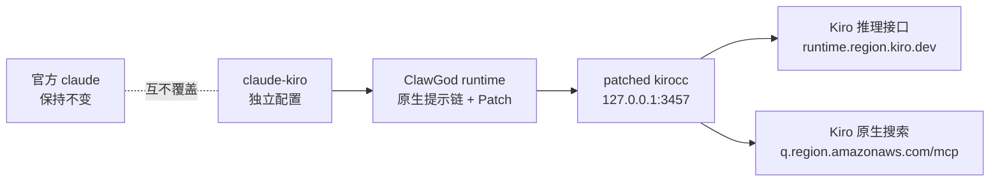

# ClawGod KiroCC

[English](README.md) · [上游 kirocc](https://github.com/d-kuro/kirocc) · [ClawGod](https://github.com/0Chencc/clawgod) · [Telegram 交流群](https://t.me/+y-jOB2WmYGo2YjQ1)

这是一个公开、可审计的 Claude Code + ClawGod + Kiro CLI 集成版本。它在
kirocc 基础上补齐 Kiro 原生 WebSearch，并通过独立的 `claude-kiro` 命令运行，
不覆盖官方 `claude` 命令。

> 本项目与 Anthropic、Amazon、Kiro、d-kuro、ClawGod 均无隶属关系。
> 仓库不包含 Claude Code 二进制、提取源码、私有内置系统提示词、账号凭据、
> 会话历史或本机生成的 ClawGod runtime。

## 交流群

安装交流和版本反馈：[加入 Telegram 交流群](https://t.me/+y-jOB2WmYGo2YjQ1)。
请勿在群内发送 Kiro 凭据、API Token、Provider 文件或 Claude 会话日志。

## 解决的问题

Claude Code 内置 WebSearch 会发送 Anthropic server tool：

```json
{
  "tools": [
    {
      "max_uses": 8,
      "type": "web_search_20250305",
      "name": "web_search"
    }
  ],
  "tool_choice": {"type": "tool", "name": "web_search"}
}
```

上游 kirocc v0.6.0 会把它当成普通客户端工具发送到 Kiro 推理接口，最终出现
`TOOL_SCHEMA_INVALID`/502。本版本改为直接调用 Kiro 原生 MCP：

```text
https://q.<region>.amazonaws.com/mcp
```

并返回 Claude Code 能识别的：

- `server_tool_use`
- 带相同 `tool_use_id` 的 `web_search_tool_result`
- `web_search_result`
- 非流式 JSON 与完整 SSE 流式事件
- `usage.server_tool_use.web_search_requests`
- 403 凭据刷新以及 429/5xx 重试

## 版本对比图

验证快照：Claude Code 2.1.220、ClawGod 1.7.5、kirocc 0.6.0、Kiro CLI
2.16.0、macOS arm64，日期 2026-08-03。

| 能力 | 官方 Claude Code | 仅 ClawGod | 上游 kirocc 0.6.0 | 我们的 ClawGod KiroCC |
| --- | :---: | :---: | :---: | :---: |
| Claude Code 原生工具和运行时 | ✅ | ✅ 已 Patch | ✅ 经协议适配 | ✅ 已 Patch |
| 使用 Kiro CLI 订阅/凭据 | — | — | ✅ | ✅ |
| 原生 effort/扩展思考 | 取决于官方账号 | 取决于 Provider | ✅ | ✅ |
| Anthropic Tool Search 模拟 | 取决于官方接口 | 取决于 Provider | ✅ | ✅ |
| 内置 WebSearch 走 Kiro MCP | — | — | ❌ 502 | ✅ |
| WebSearch 非流式与 SSE 流式 | 官方支持 | 取决于 Provider | ❌ | ✅ |
| 单独命令、配置和端口 | 官方配置 | 默认会替换/别名启动器 | 需手工配置 | ✅ |
| 本安装器不改官方 `claude` 路径 | ✅ | ❌ 默认安装行为 | ✅ | ✅ |
| DuckDuckGo 等搜索 MCP 作为备用 | 手工 | 手工 | 手工 | ✅ 可共存 |
| ClawGod 客户端功能解锁和限制移除 Patch | — | ✅ | — | ✅ |
| 绕过服务端额度、鉴权、计费或模型权限 | ❌ | ❌ | ❌ | ❌ |



## 已集成的 ClawGod 功能

本项目安装锁定的 ClawGod v1.7.5 runtime patch，并显式使用
`--lean-off`，所以独立的 `claude-kiro` 配置会保留完整 Claude Code 工具集。

| ClawGod Patch 类别 | `claude-kiro` 中包含的能力 |
| --- | --- |
| 功能解锁 | Internal User Mode 和隐藏命令、GrowthBook 功能旗标覆盖、Agent Teams、第三方 Provider Auto-mode，以及 Computer Use、Ultraplan、Ultrareview 的客户端入口解锁 |
| 限制移除 | 移除 ClawGod 文档列出的客户端安全测试拒绝提示、URL 生成限制、谨慎操作强制确认和未登录提示 |
| 地区检测中和 | 中和其文档列出的时区/代理/Base URL 地区探针和 Unicode 撇号选择器 |
| 视觉 Patch | 绿色 ClawGod 品牌色表示正在运行 Patch 版本；消息过滤 Patch 会显示原本对非 Anthropic Provider 隐藏的内容 |
| 可靠性 Patch | Bun runtime 下恢复 Glob/Grep、启用 1 小时 Prompt Cache allowlist、修复第三方 Provider billing header 导致的缓存命中问题 |
| Lean 设置 | 明确设为 `off`；不会由 Lean 模式删除 Plan mode、Agent Teams、内置 Skills、Workflows、Remote Control 或 Artifact |

仓库有意不提交 ClawGod Patch 本体、生成的 `cli.cjs` 或提取出的 Claude Code
源码。[`scripts/install.sh`](scripts/install.sh) 会下载锁定的 v1.7.5 installer、
校验 SHA-256、只在临时目录加入隔离路径覆盖，然后在用户本机生成 runtime。
因此 GitHub 显示的是可审计的集成和隔离代码，生成运行时不会进入 Git。

这里的“解锁”或“绕过限制”指修改本地 Claude Code 客户端中的检查、功能旗标或
注入提示，**不代表**可以增加 Kiro/Anthropic 服务端额度，也不能绕过服务端鉴权、
计费、限流、订阅校验、地区服务可用性或模型权限。Computer Use 和依赖 Remote
的功能仍取决于本机平台及所用后端。移除谨慎操作提示也不等于获得执行破坏性或
未授权操作的许可，运行命令前仍需自行确认。

与原版 ClawGod 不同，本项目不会替换官方 `claude` 启动器，并禁止
`claude-kiro update` 原地更新，以防破坏隔离路径和校验边界。更新请运行：

```bash
./scripts/install.sh --refresh-clawgod
```

## ClawGod 内置提示词能否继续使用

可以。ClawGod 仍然运行 Claude Code 自带的系统提示链和 runtime patch；KiroCC
只替换 Anthropic API 的后端地址，不会移除这条提示链。

但官方 Claude Code 内置系统提示词属于专有内容，本仓库不会把从 `cli.cjs` 中
提取出的提示词复制到 GitHub。公开版使用原创、可审计的
[`config/CLAUDE.md`](config/CLAUDE.md) 作为附加提示，负责：

- 优先使用 Kiro 原生 WebSearch
- 搜索答案提供来源链接
- 搜索失败时允许显式配置的 MCP 备用
- 保护官方 Claude Code 安装和更新边界
- 禁止提交凭据、Provider 文件和会话历史
- 要求测试和诚实报告真实联网验收边界

这份 `CLAUDE.md` 是附加规则，不冒充、复制或替换官方内置提示词。

## 安装

依赖：

- macOS 或 Linux
- Go 1.26+
- Node.js 18+
- Bun、ripgrep
- 已安装并登录的 Kiro CLI
- 官方 Claude Code（只在用户本机使用，不会进入仓库）

```bash
git clone https://github.com/itututu/clawgod-kirocc.git
cd clawgod-kirocc
./scripts/install.sh
claude-kiro
```

安装器会：

1. 编译带原生 WebSearch 的 kirocc。
2. 下载锁定的 ClawGod v1.7.5 installer。
3. 校验 installer SHA-256：
   `4a943439ae8cb858e69279d19f0d3a979968fc0a9e4c42e1d1018ae76657ce82`。
4. 仅在临时目录给 installer 增加隔离路径参数。
5. 把生成的 ClawGod runtime 放到 `~/.local/share/clawgod-kirocc`。
6. 把独立状态和 Claude 配置放到 `~/.clawgod-kirocc`。
7. 创建 `~/.local/bin/claude-kiro`，默认使用 3457 端口。

本安装器不会创建、替换或删除 `claude` 命令。

如果已有独立 ClawGod：

```bash
CLAWGOD_BIN=/绝对路径/clawgod ./scripts/install.sh --gateway-only
```

更新隔离 runtime：

```bash
./scripts/install.sh --refresh-clawgod
```

卸载但保留配置和会话状态：

```bash
./scripts/uninstall.sh
```

同时删除独立状态：

```bash
./scripts/uninstall.sh --purge-state
```

## 当前支持边界

- Claude Code 实际发出的“仅包含一个原生 WebSearch server tool”的请求已支持。
- 如果手工把原生 WebSearch 与其他客户端工具放在同一次 API 请求中，目前明确
  返回 HTTP 400，而不是上游 502。
- 自动测试覆盖 Kiro MCP 请求头、嵌套 JSON、403 刷新、非流式块结构、SSE
  事件顺序、`tool_use_id` 配对和 token count。
- Kiro 订阅、服务可用性以及搜索内容质量仍由 Kiro 上游决定。

## 测试

```bash
make test
GOEXPERIMENT=jsonv2 go vet ./...
```

`make test` 会执行 `go test -race ./...`。

## 许可证和上游

- 本仓库以及 kirocc 衍生代码：Apache-2.0。
- 原始 kirocc：<https://github.com/d-kuro/kirocc>，Apache-2.0。
- ClawGod：<https://github.com/0Chencc/clawgod>，GPL-3.0；本仓库不重新分发，
  只在用户机器上下载并生成独立 runtime。
- Claude Code：Anthropic 专有软件，不包含在仓库中。

具体归属和修改说明见 [`NOTICE`](NOTICE)。
